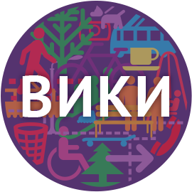
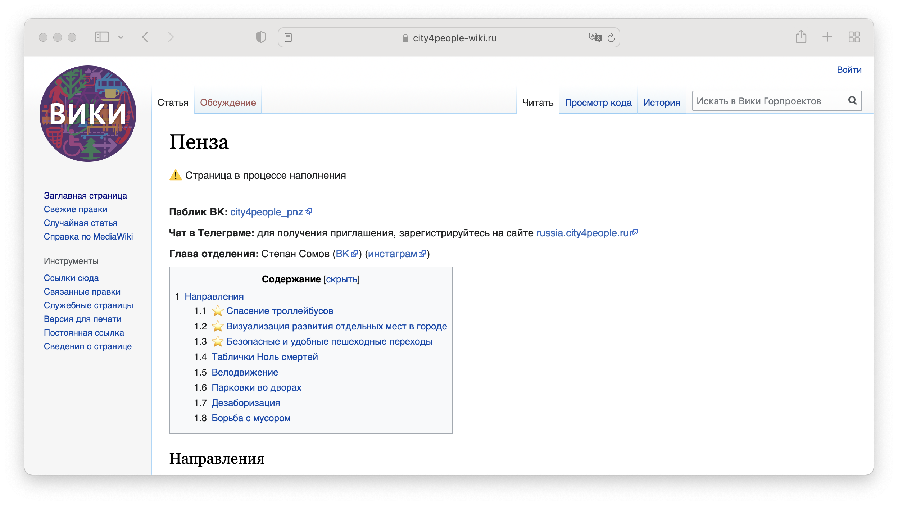
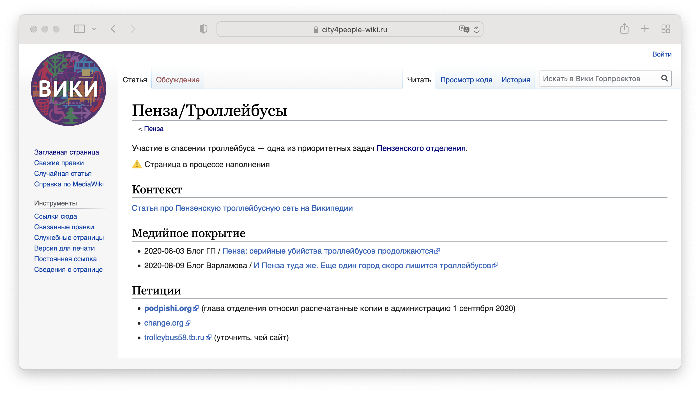
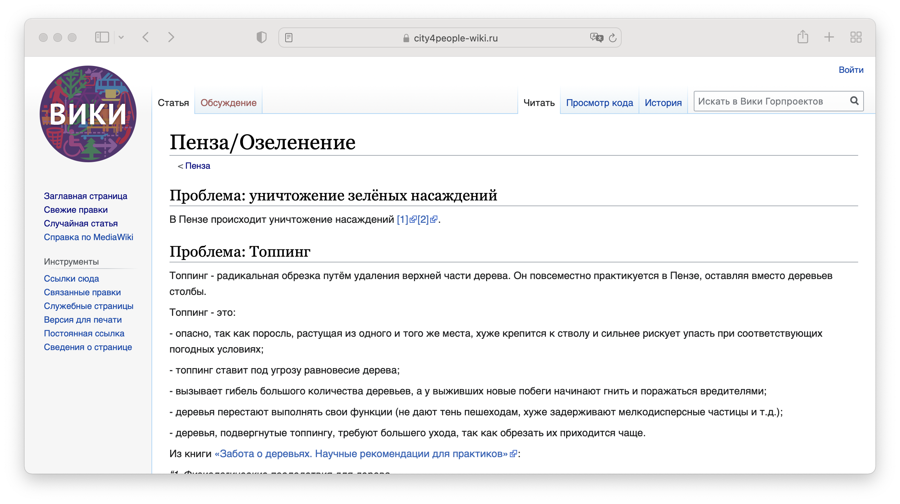

# Вики Горпроектов

> **EN:** This repo contains setup instructions for a [MediaWiki](https://www.mediawiki.org/wiki/MediaWiki) instance that uses [Telegram auth](https://core.telegram.org/widgets/login) for user to login
>
> 👀 [English version via Google Translate](https://translate.google.com/translate?sl=ru&tl=en&u=https://github.com/kachkaev/city4people-wiki/blob/main/README.md)

&nbsp;  
&nbsp;  
&nbsp;

<!-- markdownlint-disable-next-line -->
<p align="center"></p>

&nbsp;  
&nbsp;  
&nbsp;

## Статус проекта

Вики Горпроектов была запущена в сентябре 2020 года по адресу `city4people-wiki.ru` в качестве эксперимента.
Её использовали [в Пензенском отделении](https://vk.com/city4people_pnz) для упорядочивания местных задач, но активность на сайте продлилась недолго.
Инфрастуктура была свёрнута в ноябре 2021 года из-за отсутствия интереса к вики у сообщества и со стороны федерального штаба ГП.

Этот репозиторий содержит инструкции по развёртыванию инфраструктуры для Вики-движок легко воссоздать в случае необходимости.

Содержимое удалённых вики-страниц сохранено в папку [`legacy`](./legacy/).







Ниже приводится документация в её изначальном виде.

---

[Вики Горпроектов](https://city4people-wiki.ru) работает на [Медиавики](https://mediawiki.org) — том же движке, что и Википедия.
Этот выбор определяет низкий порог входа для участников, а также задаёт понятные и проверенные правила для взаимодействия в сообществе.

Все технические компоненты вики имеют открытый исходный код и не требуют платных лицензий.
Если обслуживание ресурса осуществляется волонтёрами, платным остаётся только веб-хостинг.

Движок настроен так, чтобы процесс редактирования содержимого мало чем отличался от Википедии.
Единственная существенная разница в настройке Медиавики — [авторизация через Телеграм](https://core.telegram.org/widgets/login).
Благодаря этой интеграции участникам не приходится придумывать логины и пароли, а администраторам проще отслеживать и модерировать правки.

Войти в вики может любой пользователь Телеграма при наличии имени пользователя в профиле.
Существует техническая возможность варьировать доступ к страницам в зависимости от статуса человека в федеральной сети ГП — это требует дополнительной настройки.

## Архитектура

Вики развёрнута поверх кластера на [Кубернетисе](https://kubernetes.io).
Это даёт свободу выбора хостинга и позволяет при необходимости масштабировать нагрузку, не меняя архитектуры.

В кластере развёрнуто два одинаковых по структуре экземпляра вики:

- основная вики  
  <https://city4people-wiki.ru>

- песочница  
  <https://sandbox.city4people-wiki.ru>

Песочница служит местом экспериментов как для системных администраторов, так и для участников.

Перед тем, как выкатывать техническое обновление на основную вики, оно пробуется в песочнице.
В процессе этой работы инструкции в этом репозитории обновляются.
Таким образом, при технических изменениях в основной вики системный администратор выполняет уже проверенные шаги.
Это уменьшает риск недоступности сайта или потери данных.

Полнота инструкций должна позволить оперативно починить систему в случае серьёзной технической аварии.

---

Каждый экземпляр вики включает следующие компоненты:

- [Хелм-чарт для развёртывания Медиавики](https://hub.helm.sh/charts/bitnami/mediawiki) (создан компанией Битнами)

- [Хелм-чарт для настройки внешнего доступа к вики](./helm-charts/webapp-ingress) (в этом репозитории)

- [Исходники телеграм-бота](./telegram-bot), [скрипт для его контейнеризации](./github/workflow/docker.yml) и [хемл-чарт для развёртывания](./helm-charts/webapp-ingress) (в этом репозитории)

Образ контейнера для телеграм-бота [хранится на Гитхабе](https://github.com/kachkaev/city4people-wiki/packages) и автоматически обновляется при создании нового [релиза](https://github.com/kachkaev/city4people-wiki/releases).

## Развёртывание

### Требования к среде

1.  Кластер на [Кубернетисе](https://kubernetes.io)

    - ☑️ Возможность удовлетворять запросы на создания хранилищ _(persistent volume claims)_ в режиме `ReadWriteMany`

      Для каждого экземпляра вики рекомендуется выделять минимум 10 гигабайт для БД И 20 гигабайт для медиа-загрузок

    - ☑️ [Трафик](https://traefik.io) в качестве ингрес-контроллера

      Если используется другой контроллер, от инструкций ниже придётся немного отступить

    - Автоматический резолвер сертификатов [Летс-энкрипт](https://letsencrypt.org) в ингрес-контроллере

1.  Локально установленные команды `kubectl` и `helm`

1.  Настроенный доступ к кластеру (`KUBECONFIG`) с правом создавать ресурсы в пространстве имён `city4people-wiki`

1.  Доступ по `SSH` к хранилищам в кластере

    Требуется для загрузки и обновления ресурсов Медиавики (настройки, дополнительные расширения, и т. д.)

1.  Доступ к реестру с образами контейнеров на Гитхабе

    См. <https://stackoverflow.com/a/61912590/1818285>

    ```sh
    # GITHUB_USER=
    # GITHUB_TOKEN=
    
    echo "{\"auths\":{\"docker.pkg.github.com\":{\"auth\":\"$(echo -n ${GITHUB_USER}:${GITHUB_TOKEN} | base64)\"}}}" | kubectl create secret generic dockerconfigjson-github-com --type=kubernetes.io/dockerconfigjson --from-file=.dockerconfigjson=/dev/stdin --namespace=city4people-wiki
    ```

### Развёртывание Медиавики

Используется хелм-чарт, созданный компанией Битнами

- [документация](https://hub.helm.sh/charts/bitnami/mediawiki)
- [исходники](https://github.com/bitnami/charts/tree/master/bitnami/mediawiki)
- [файл values.yaml](https://github.com/bitnami/charts/blob/master/bitnami/mediawiki/values.yaml)

```sh
helm repo add bitnami https://charts.bitnami.com/bitnami

INSTANCE=main
INSTANCE_HOST=city4people-wiki.ru
MEDIAWIKI_NAME="Вики Горпроектов"
# MARIADB_ROOTUSER_PASSWORD=
# MEDIAWIKI_PASSWORD=

INSTANCE=sandbox
INSTANCE_HOST=sandbox.city4people-wiki.ru
MEDIAWIKI_NAME="Вики-песочница"
# MARIADB_ROOTUSER_PASSWORD=
# MEDIAWIKI_PASSWORD=

cat <<EOF >/tmp/values-for-webapp.yaml
image:
  tag: 1.35.0-debian-10-r8
service:
  type: ClusterIP
persistence:
  accessMode: ReadWriteMany
  enabled: true
  size: 20Gi
allowEmptyPassword: no
mediawikiEmail: alexander@kachkaev.ru
mediawikiHost: ${INSTANCE_HOST}
mediawikiName: ${MEDIAWIKI_NAME}
mediawikiPassword: "${MEDIAWIKI_PASSWORD}"
mediawikiUser: admin
mariadb:
  master:
    persistence:
      accessModes:
        - ReadWriteMany
      enabled: true
      size: 10Gi
  rootUser:
    password: "${MARIADB_ROOTUSER_PASSWORD}"
EOF

## install
helm install --namespace=city4people-wiki "${INSTANCE}-webapp" bitnami/mediawiki --values /tmp/values-for-webapp.yaml

## upgrade
helm upgrade --namespace=city4people-wiki "${INSTANCE}-webapp" bitnami/mediawiki --values /tmp/values-for-webapp.yaml

## uninstall
# helm uninstall --namespace=city4people-wiki "${INSTANCE}-webapp"
```

### Настройка внешнего доступа к вики

В отдельном [хелм-чарте для ингреса](./helm-charts/webapp-ingress) используются [нестандартные ресурсы Кубернетиса](https://doc.traefik.io/traefik/v2.3/providers/kubernetes-crd/) _(Custom Resource Definitions)_.
Они помогают настроить перенаправления с поддомена `www`, заголовки `HTTP`-запросов и сжатие данных.

Если вместо Трафика используется nginx или другой тип ингрес-контроллера, чарт придётся подправить.

```sh
INSTANCE=main
cat <<EOF >/tmp/values-for-webapp-ingress.yaml
host: city4people-wiki.ru
serviceName: main-webapp-mediawiki
extraFiles:
  - path: robots.txt
    content: |-
      User-agent: *
      Allow: /
      Disallow: /*?*mobileaction=
EOF

INSTANCE=sandbox
cat <<EOF >/tmp/values-for-webapp-ingress.yaml
host: sandbox.city4people-wiki.ru
serviceName: mediawiki
extraFiles:
  - path: robots.txt
    content: |-
      User-agent: *
      Disallow: /
EOF

## install
helm install --namespace=city4people-wiki "${INSTANCE}-webapp-ingress" ./helm-charts/webapp-ingress --values /tmp/values-for-webapp-ingress.yaml

## upgrade
helm upgrade --namespace=city4people-wiki "${INSTANCE}-webapp-ingress" ./helm-charts/webapp-ingress --values /tmp/values-for-webapp-ingress.yaml

## uninstall
# helm uninstall --namespace=city4people-wiki "${INSTANCE}-webapp-ingress"
```

### Развёртывание Телеграм-бота

[Авторизация через Телеграм](https://core.telegram.org/widgets/login) требует наличия бота.
Этот бот должен быть привязан к домену сервера, на котором размещена кнопка входа.

Для создания бота следует отправить команду `/newbot` боту [@BotFather](https://t.me/BotFather).
Привязка бота к домену настраивается там же.

Развёртывать сервер для бота строго говоря не обязательно, так как весь процесс авторизации проводит сам Телеграм.
Работающий бот лишь отвечает на сообщения пользователей ссылкой на вики.

```sh
INSTANCE=main
INSTANCE_HOST=city4people-wiki.ru
TELEGRAM_BOT_USERNAME=city4people_wiki_bot
# TELEGRAM_BOT_TOKEN=

INSTANCE=sandbox
INSTANCE_HOST=sandbox.city4people-wiki.ru
TELEGRAM_BOT_USERNAME=sandbox_wiki_bot
# TELEGRAM_BOT_TOKEN=

IMAGE_TAG=v2020100301

cat <<EOF >/tmp/values-for-telegram-bot.yaml
botDomain: "${INSTANCE_HOST}"
botToken: "${TELEGRAM_BOT_TOKEN}"
botUsername: ${TELEGRAM_BOT_USERNAME}
image:
  tag: ${IMAGE_TAG}
imagePullSecrets:
  - name: dockerconfigjson-github-com
resources:
  requests:
    cpu: 10m
    memory: 100Mi
  limits:
    cpu: 1000m
    memory: 200Mi
EOF

## install
helm install --namespace=city4people-wiki "${INSTANCE}-telegram-bot" ./helm-charts/telegram-bot --values /tmp/values-for-telegram-bot.yaml

## upgrade
helm upgrade --namespace=city4people-wiki "${INSTANCE}-telegram-bot" ./helm-charts/telegram-bot --values /tmp/values-for-telegram-bot.yaml

## uninstall
# helm uninstall --namespace=city4people-wiki "${INSTANCE}-telegram-bot"
```

### Донастройка Медиавики после развёртывания

```sh
MEDIAWIKI_PV_SSH_HOST=kachkaev--firstvds--city4people-wiki
MEDIAWIKI_PV_PATH=/var/www/local-pvs/city4people-wiki-main-mediawiki
```

#### Синхронизация ресурсов Медиавики из этого репозитория

Хранилище пода с Медиавики содержит файл `mediawiki/LocalSettings.php`.
После создания _нового_ экземпляра веб-приложения следует вручну добавить в него эти две строчки:

```php
// в начале файла
import "./LocalSettingsDebug.php";

// в конце файла
`import "./LocalSettingsTailoring.php";`
```

Команды для синхронизации ресурсов из локальной копии этого репозитория:

```sh
## модуль для авторизации через Телеграм
rsync --archive --delete --stats --human-readable custom-mediawiki-resources/extensions/TelegramAuth/ ${MEDIAWIKI_PV_SSH_HOST}:${MEDIAWIKI_PV_PATH}/mediawiki/extensions/TelegramAuth
```

```sh
## Донастройка движка (LocalSettingsDebug.php и LocalSettingsTailoring.php)
rsync --archive --stats --human-readable custom-mediawiki-resources/LocalSettings*.php ${MEDIAWIKI_PV_SSH_HOST}:${MEDIAWIKI_PV_PATH}/mediawiki/
```

```sh
## Логотипы
rsync --archive --stats --human-readable visuals/main/mediawiki/*.png ${MEDIAWIKI_PV_SSH_HOST}:${MEDIAWIKI_PV_PATH}/mediawiki/images/
```

#### Группа `ssotelegram`

Участникам, вошедшим через Телеграм, автоматически присваивается группа `ssotelegram` (_SSO – Single sign-on_).
Это может упростить контроль [прав доступа](https://www.mediawiki.org/wiki/Manual:User_rights) в будущем.

Чтобы группа `ssotelegram` отображалась на страницах вики по-русски, следует создать три служебные страницы:

- `MediaWiki:Group-ssotelegram`

  > Пользователи Телеграма

- `MediaWiki:Group-ssotelegram-member`

  > пользователь Телеграма

- `MediaWiki:Grouppage-ssotelegram`
  > Пользователи Телеграма

#### Расширения

Установка дополнительных расширений для Медиавики делает движок более похожим на Википедию, что упрощает работу участникам.

Эти же команды используются для обновления расширений после выхода новых версий.

```sh
## ℹ️ Терминал внутри MEDIAWIKI_PV_SSH_HOST

EXTENSIONS_DIR=${MEDIAWIKI_PV_PATH}/mediawiki/extensions

## https://www.mediawiki.org/wiki/Extension:MobileFrontend
mv ${EXTENSIONS_DIR}/MobileFrontend ${EXTENSIONS_DIR}/MobileFrontend.bak
wget -c https://extdist.wmflabs.org/dist/extensions/MobileFrontend-REL1_35-8d06152.tar.gz -O - | tar -xz -C $EXTENSIONS_DIR

## https://www.mediawiki.org/wiki/Extension:TemplateStyles
mv ${EXTENSIONS_DIR}/TemplateStyles ${EXTENSIONS_DIR}/TemplateStyles.bak
wget -c https://extdist.wmflabs.org/dist/extensions/TemplateStyles-REL1_35-7743810.tar.gz -O - | tar -xz -C $EXTENSIONS_DIR

mv ${EXTENSIONS_DIR}/PluggableAuth ${EXTENSIONS_DIR}/PluggableAuth.bak
wget -c https://extdist.wmflabs.org/dist/extensions/PluggableAuth-REL1_35-2a465ae.tar.gz -O - | tar -xz -C $EXTENSIONS_DIR

chmod 755 ${EXTENSIONS_DIR}/Scribunto/includes/engines/LuaStandalone/binaries/lua5_1_5_linux_64_generic/lua

# rm -rf ${EXTENSIONS_DIR}/*.bak
```

#### Темы оформления

```sh
## ℹ️ Терминал внутри MEDIAWIKI_PV_SSH_HOST

SKINS_DIR=${MEDIAWIKI_PV_PATH}/mediawiki/skins

# https://www.mediawiki.org/wiki/Skin:Minerva_Neue
mv ${SKINS_DIR}/MinervaNeue ${SKINS_DIR}/MinervaNeue.bak
wget -c https://extdist.wmflabs.org/dist/skins/MinervaNeue-REL1_35-bb52d27.tar.gz -O - | tar -xz -C $SKINS_DIR

# rm -rf ${SKINS_DIR}/*.bak
```

#### Шаблоны и стили

После создания нового экземпляра вики следует импортировать шаблоны и стили из русской Википедии.
Действия ниже можно периодически повторять для обновления.

1.  Зайти на на страницу <https://ru.wikipedia.org/wiki/Служебная:Экспорт>

    1.  Вбить в форму экспорта следующий текст:

        ```txt
        MediaWiki:Common.css
        MediaWiki:Minerva.css
        MediaWiki:Mobile.css
        Шаблон:Ambox
        Шаблон:Внимание
        ```

    1.  Поставить все три галочки

    1.  Нажать «Экспортировать» и сохранить файл локально

1.  Зайти на страницу `Служебная:Импорт` нужного экземпляра вики

    1.  Выбрать скаченный файл `xml`

    1.  В качестве префикса интервики выбрать `wikipedia_ru`

    1.  Нажать «Загрузить файл»

1.  Закомменировать стили главной страницы в `Mobile.css`, чтобы убрать серый фон

#### Настройка расширения для авторизации через Телеграм

Настройки расширения `TelegramAuth` включены в файл `LocalSettingsTailoring.php`.
В случае изменения токена бота, его хэш придётся перегенерировать.
Поможет эта команда:

```sh
# export TELEGRAM_BOT_TOKEN=
node --eval 'console.log(require("crypto").createHash("sha256").update(process.env.TELEGRAM_BOT_TOKEN).digest("hex"));'
```

### Настройка резервного копирования

Резервные копии данных Медивики создаются автоматически раз в сутки хостинг-провайдером.

> TODO: Настроить отправку копии на _AWS S3_ или другие облачные хранилища при помощи Кубернетиса

### Хаки для песочницы

Чтобы песочница визуально отличалась от основной вики, следует добавить следующий код в начало двух страниц `MediaWiki:*.css` — фон станет жёлтым.

`MediaWiki:Common.css` (настольный режим)

```css
/* begin sandbox hacks */

body {
  background-color: #ffeeb2 !important;
}

#mw-page-base {
  background-image: linear-gradient(
    to bottom,
    #ffffff 50%,
    #ffeeb2 100%
  ) !important;
}

.vector-menu-tabs li {
  background-image: linear-gradient(
    to top,
    #77c1f6 0,
    #ffeeb2 1px,
    #ffffff 100%
  ) !important;
}

.vector-menu-tabs .selected {
  background: #ffffff !important;
}

/* end sandbox hacks */
```

`MediaWiki:Mobile.css` (мобильный режим)

```css
/* begin sandbox hacks */

#mw-mf-page-center,
#mw-mf-page-left,
.header-container.header-chrome {
  background-color: #ffeeb2 !important;
}

/* end sandbox hacks */
```

## Заметки по Медиавики

### Полезные служебные страницы

- `MediaWiki:Sitenotice`
- `Special:Version`
- `Template:Infobox`

### Отладка шаблонов

`&uselang=qqx`
